# LINUX
# Azure Account Setup  
1. Created a Microsoft Azure account using my university-provided email address.  
2. Learned about cloud computing and its importance.  
3. Activated student benefits and set up a student account, receiving **$100** in Azure credits for use within the platform.  

# Virtual Machine Setup  
1. Created a virtual machine for coursework.  
2. Selected **Ubuntu Server 24.04 LTS Gen 2** from the Marketplace, published by Canonical.  
3. Named the virtual machine **"lab-robotics"**.  
4. Chose the **Standard_B2ls_v2** configuration from the B-series.  
5. Created a new resource group and subnet for organizing and allocating the machine.  

# GitHub Configuration  
1. Created a new repository named **"LINUX"** for the assignment.  
2. Added my HAMK email address as a secondary email to my GitHub account for version control.  


# Assignment 3: User Management and File System Access

## Step 1: Creating Users  
- First, I created two users: **tupu** and **lupu**.  
- Then, I set **passwords** and other necessary details to ensure only they can access their files.  
- I used the `sudo` and `adduser` commands for this:  

        sudo adduser tupu  

## Step 2: Creating the `lupu` User  
- Next, I created the `lupu` user using the `useradd` command:  

        sudo useradd -m -d /home/lupu -s /bin/bash -G lupu lupu  

  Explanation of flags:  
  - `-m`: Creates the user's home directory.  
  - `-d /home/lupu`: Specifies the home directory path.  
  - `-s /bin/bash`: Sets the login shell to Bash.  
  - `-G lupu`: Adds the user to the `lupu` group.  

## Step 3: Creating the `hupu` System User  
- Additionally, I created a system user named `hupu`, with the login shell set to **/bin/false** to prevent login:  

        sudo useradd --system --shell /bin/false hupu  

  Explanation of flags:  
  - `--system`: Creates a system account.  
  - `--shell /bin/false`: Prevents the user from logging in.  

## Step 4: Granting Sudo Privileges  
- I used **visudo** to edit the sudoers file:  

        sudo visudo  

- Then, I added the following lines to grant sudo access to both users:  

        tupu ALL=(ALL:ALL) ALL  
        lupu ALL=(ALL:ALL) ALL  

- There are alternative methods to do this, but I chose this approach while testing both.  


## Step 5:
- I create directory in **/opt/projekti** and add both users

        sudo mkdir /opt/projekti

- Then crete a group called projekti and assign both tupu and lupu into the group and the commands are:

        sudo groupadd projekti
        sudo usermod -aG projekti tupu
        sudo usermod -aG projekti lupu

- And give ownership to projekti group.

        sudo chown :projekti /opt/projekti

- And **set permission** so that tupu and lupu can access the file in all three formate like read, write and execute files.

        sudo chmod 770 /opt/projekti

- The following command ensures that any new files created within the /opt/projekti directory inherit the group ownership of projekti, maintaining the desired permissions.

        sudo chmod g+s /opt/projekti

## Output:

        drwxrws--- 2 root projekti 4096 Jan 30 16:02 /opt/projekti

### Here is the screenshots of the practical.

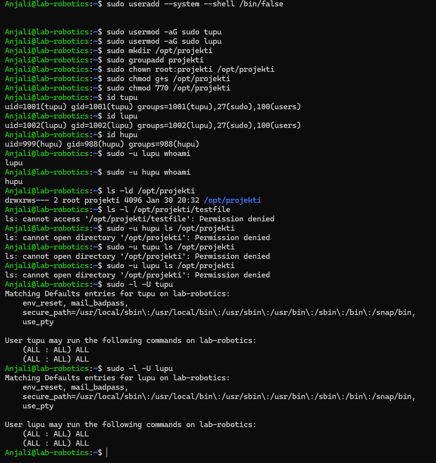

# APT Package Management Assignment

## Part 1: Understanding APT & System Updates

### 1. Check APT Version
```sh
apt --version
```
**Output:**
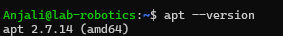

### 2. Update the Package List
```sh
sudo apt update
```

**Explanation:**  
Why Update the Package List?
- Fetches the latest software info from repositories.
- Ensures access to new versions, security patches, and dependencies.

### 3. Upgrade Installed Packages
```sh
sudo apt upgrade -y
```

**Difference between `update` and `upgrade`:**  
- `update` Refreshes the list of available packages.

- `upgrade`: Installs the latest versions of installed packages.

### 4. View Pending Updates
```sh
apt list --upgradable
```
**Pending Updates:**  


## Part 2: Installing & Managing Packages

### 1. Search for a Package
```sh
apt search image editor
```
**Selected Package:**  
- Though, there are many packages but that doesn't fit in the screenshot :)
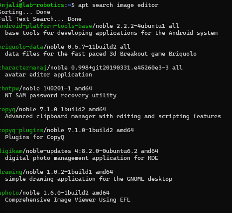

### 2. View Package Details
```sh
apt show drawing
```
**Dependencies:**  


### 3. Install the Package
```sh
sudo apt install drawing -y
```
**Confirmation of Installation:**  
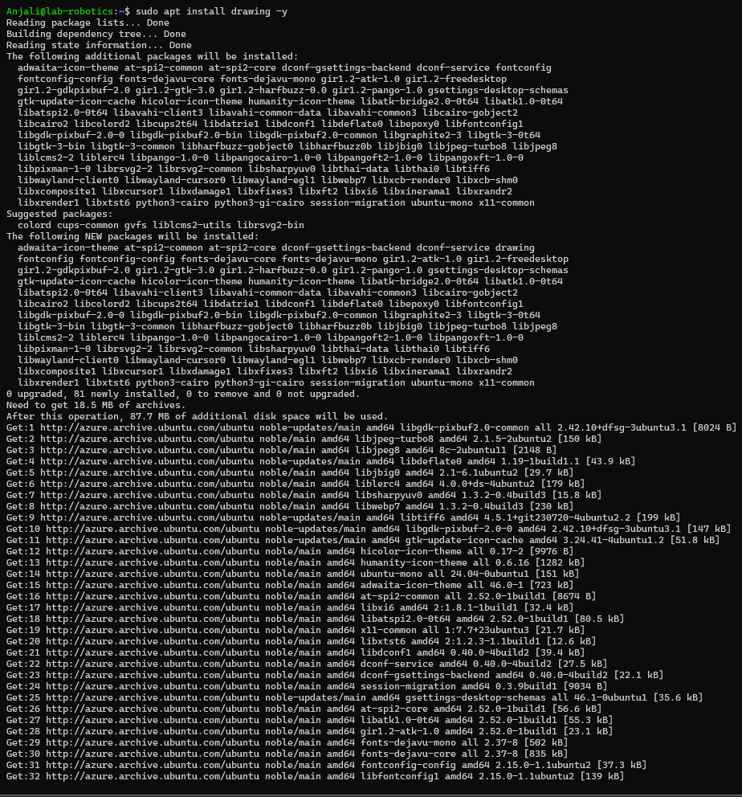


### 4. Check Installed Package Version
```sh
apt list --installed | grep drawing
```
**Installed Version:**  


## Part 3: Removing & Cleaning Packages

### 1. Uninstall the Package
```sh
sudo apt remove drawing -y
```
**Is the package fully removed?**  

### 2. Remove Configuration Files
```sh
sudo apt purge drawing -y
```


**Difference between `remove` and `purge`:**  
- `remove` Uninstalls the package but keeps configuration files.
- `purge` Uninstalls the package and removes its configuration files.
### 3. Remove Unnecessary Dependencies
```sh
sudo apt autoremove -y
```
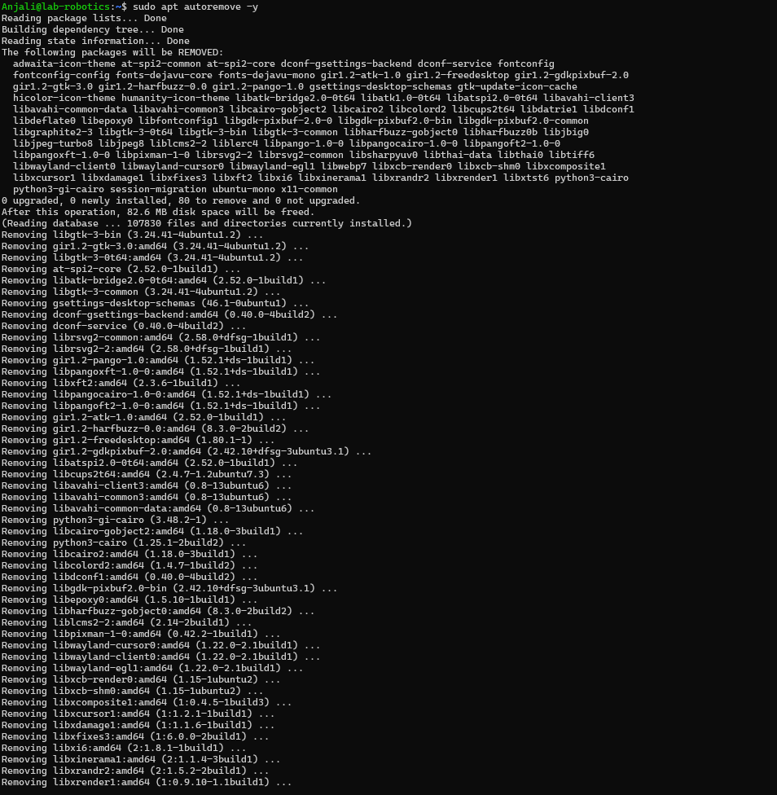
**Why is this step important?**  
It removes unused dependencies that were installed alongside a package but are no longer needed, freeing up disk space.

### 4. Clean Up Downloaded Package Files
```sh
sudo apt clean
```

**What does this command do?**  
It deletes all downloaded `.deb` files from `/var/cache/apt/archives`, freeing up space.


## Part 4: Managing Repositories & Troubleshooting

### 1. List APT Repositories
```sh
cat /etc/apt/sources.list
```
**Observations:**  

### **What’s in `/etc/apt/sources.list`?**

- Contains **repository URLs** where software packages are stored.  
- Includes **distribution codenames** (e.g., `focal` for Ubuntu 20.04).  
- Lists **components** like `main`, `universe`, `restricted`, and `multiverse`.  
- Defines **repository types**: `deb` (binary packages) and `deb-src` (source code).  


### 2. Add a New Repository
```sh
sudo add-apt-repository universe
sudo apt update
```

**Types of Packages in Universe Repository:**  
Community-maintained software, which may not receive the same level of support as main repository packages.

### 3. Simulate an Installation Failure
```sh
sudo apt install fakepackage
```
**Error Message:**  


### 4. Troubleshooting Steps
*Check the Package Name**:
   - Make sure the package name is correct. Use:
     ```bash
     apt search <keyword>
     ```
     to find the right package.
**Update the Package List**:
   - Run:
     ```bash
     sudo apt update
     ```
     to refresh the list of available packages.

3. **Check Repositories**:
   - Ensure the required repository is enabled in `/etc/apt/sources.list`.
   - Add the repository if needed:
     ```bash
     sudo add-apt-repository <repository-name>
     sudo apt update
     ```
---

## Bonus Challenge: Holding & Unholding Packages

### 1. Hold a Package
```sh
sudo apt-mark hold drawing  
```

### 2. Unhold a Package
```sh
sudo apt-mark unhold drawing
```


**Why would you want to hold a package?**  
This prevents the package from being upgraded.

**Why would you want to unhold a package?**
This allows the package to be upgraded again.
#### Thank You :)


# Virtualization

## Part 1: Introduction to virtualization concepts

1### 1. Virtualization  
The process of creating virtual replicas of physical resources (OS, storage, or machines) to optimize hardware utilization.

### 2. Hypervisor  
Software that creates/manages **Virtual Machines (VMs)**, enabling multiple OSes to run on a single physical host.

### 3. Virtual Machines (VMs)  
Emulated computer systems that replicate physical hardware.  
Example: Running Windows and Linux simultaneously on one machine.

### 4. Containers  
Lightweight, isolated environments that share the host OS kernel.  
Key Advantage: Better resource efficiency than VMs.


### 5. VMs vs Containers  
| **Feature**       | **Virtual Machines**               | **Containers**                |
|--------------------|-------------------------------------|--------------------------------|
| Architecture       | Full OS + virtualized hardware      | Shared host OS kernel          |
| Resource Usage     | High (dedicated resources)          | Lightweight                    |
| Isolation          | Strong (separate OS instances)      | Moderate (shared kernel)       |
| Scalability        | Full-system scaling                 | Granular microservice scaling  |

---
## Part 2: Working with Multipass

1. multipass boot: Launch the default Ubuntu instance.
2. multipass list: List all running instance.
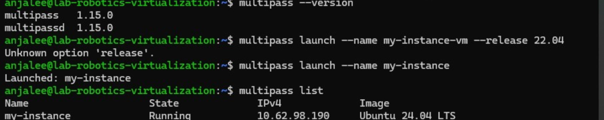
3. multipass info: View details about a specific instance.
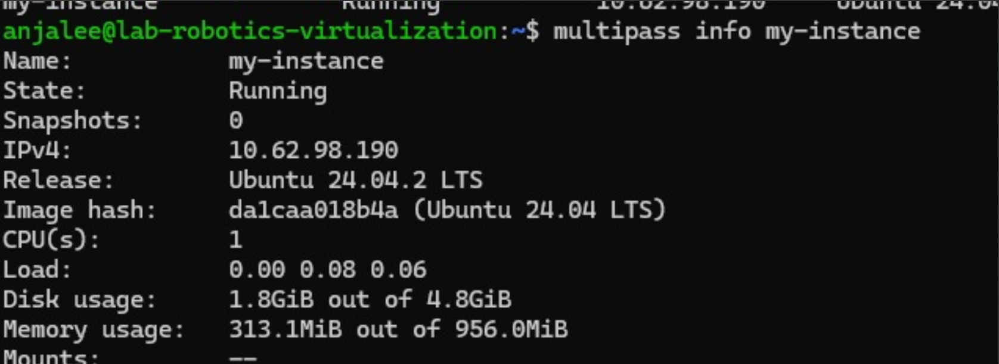
4. multipass shell: Access to the shell of a running instance.
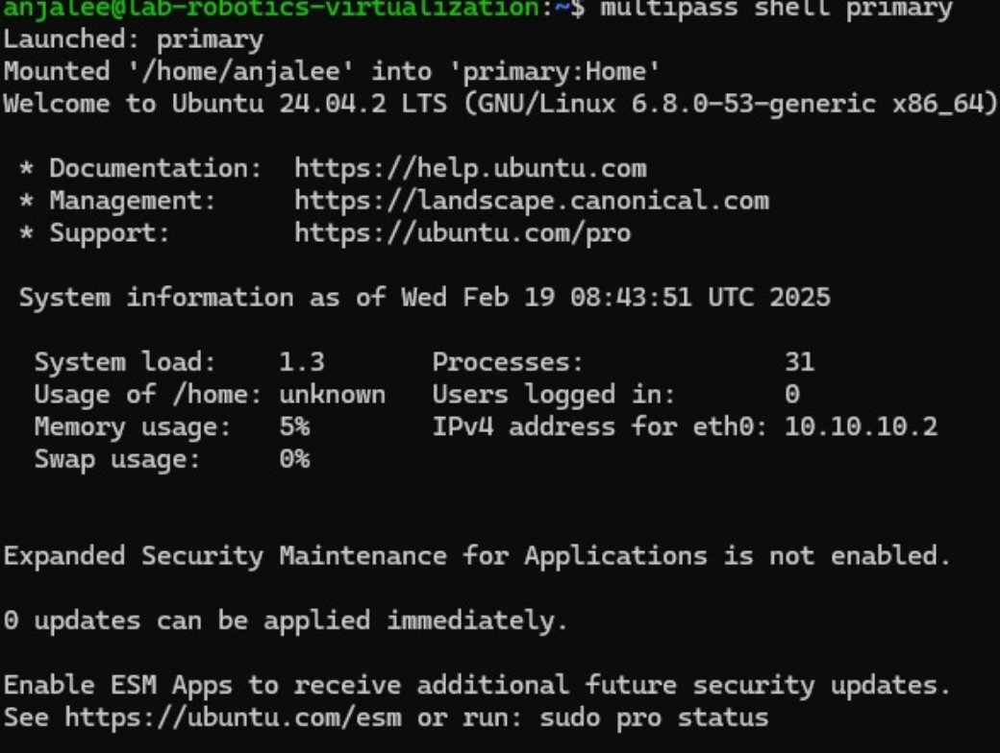
5. multipass exec: Run the command on the instance.
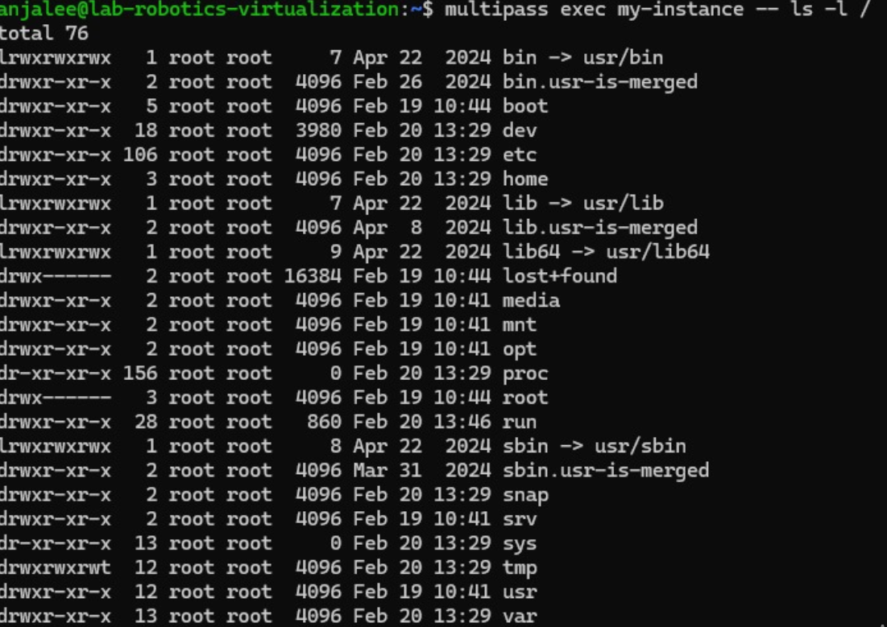

- Cloud-init: 

First of all, create a cloud-init.yaml file using command:

        touch cloud-init.yaml

then open that file and paste the following line and save it.

        #cloud-config
        package_update: true
        packages:
            - nginx

Then, launch a new instance with this configuration:

        multipass launch --name custom-instance --cloud-init cloud-init.yaml

- Share files between host and instance

        multipass mount /home/user/shared my-instance:/mnt/shared


        multipass umount my-instance:/mnt/shared


## Part 3: Exploring LXD

### What is LXD?
**LXD** (Linux Container Daemon) is a next-generation system container manager built on LXC (Linux Containers). It provides:
- A user-friendly interface to manage system containers and VMs
- Full Linux environment isolation on a single host
- Lightweight alternative to traditional virtualization

### Key Features
-  Combines container speed with VM-like security
-  Minimal overhead compared to full virtualization
-  Supports both containers and virtual machines
-  Secure by default with resource constraints

- Installing:

                sudo apt update
                sudo apt install -y ldx


                lxd --version

                sudo lxd init

                sudo usermod -aG lxd $USER
                newgrp lxd

                lxc launch images:ubuntu:24.04 anjali-container

                lxc list


- In the following screenshot, You can see the steps of how to run it.

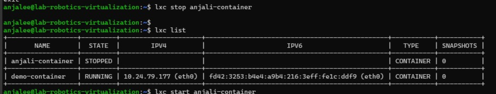


## Part 4: How to Stick Apps with Docker

- Installation:

!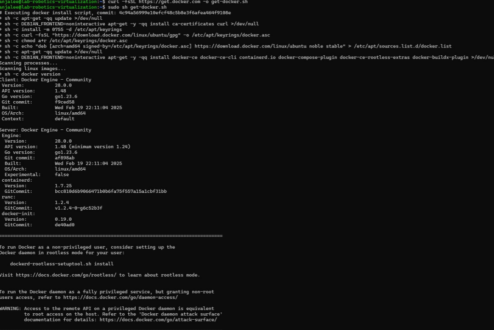


-Basic Docker Concepts

1. Images: Read-only templates used to create containers.

2. Containers: Running instances of Docker images.

3. Dockerfiles: Scripts that gives instruction on how to build a Docker image.

- Experiment

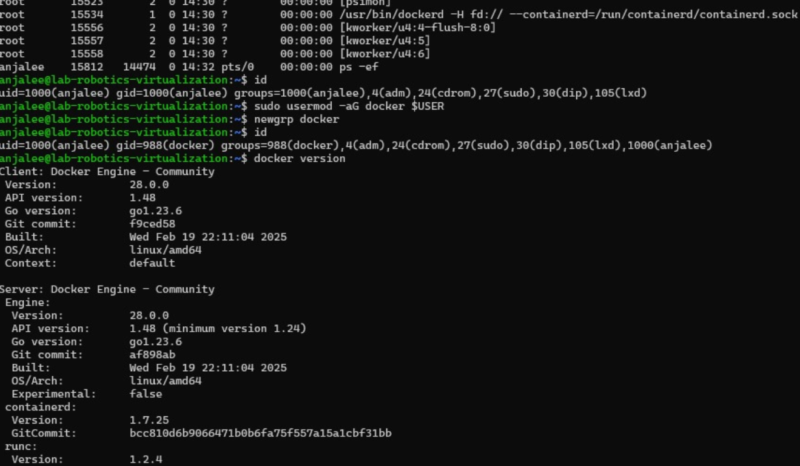
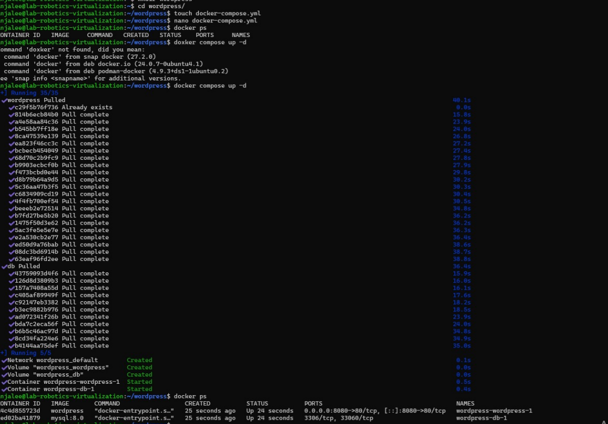
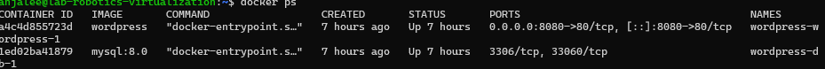

## Part 5: Snaps for Self-Contained Applications

- Creating a Basic Snap

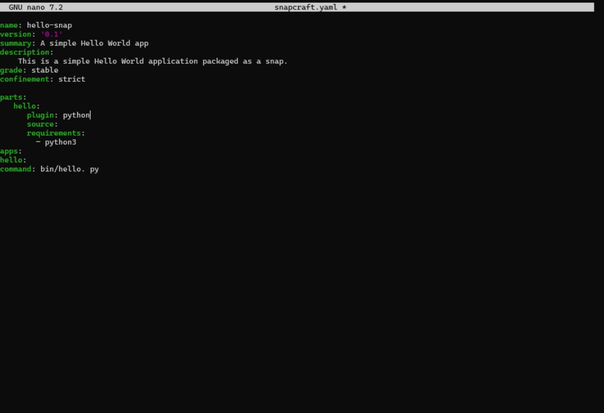

- After that run the following commands:

                snapcraft

                sudo snap install my-app_1.0_amd64.snap --dangerous

- This will create a file that contain our code:

                hello-world.py

- It will show the output of the file:
